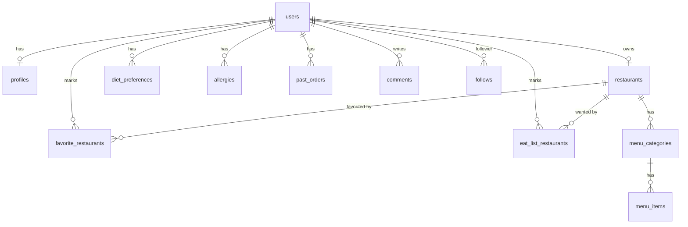

# YemekYemek PostgreSQL Şeması

Bu klasör, `yemekyemek_arayuz` Flutter uygulamasının şu an yerel `.txt` dosyalarında
(`users.txt`, `profiles.txt`, `restaurants.txt`, bkz. `LocalFileStore`) tuttuğu verilerin
gerçek bir PostgreSQL veritabanında nasıl saklanacağını tanımlar.

> **Durum:** Node.js backend ve Flutter `Remote*Repository` sınıfları bu şemayı
> kullanır. Bağlantı bilgileri `backend/.env` içindeki `DATABASE_URL` üzerinden
> okunur; Flutter PostgreSQL'e doğrudan değil, HTTP API üzerinden erişir.

## Dosyalar ve çalıştırma sırası

Foreign key bağımlılıkları yüzünden dosyaların **numaralandırılmış sırada** çalıştırılması gerekir:

| # | Dosya | İçerik |
|---|-------|--------|
| 1 | `00_extensions.sql` | `pgcrypto` extension (uuid üretimi için `gen_random_uuid()`) |
| 2 | `01_users.sql` | `users` tablosu + `user_role` enum (`user` / `restaurant_owner`) |
| 3 | `02_profiles.sql` | `profiles` tablosu (bio, takipçi/takip sayaçları, rozet) |
| 4 | `03_restaurants.sql` | `restaurants` tablosu (restoran paneli bilgileri) |
| 5 | `04_menu.sql` | `menu_categories`, `menu_items` |
| 6 | `05_profile_lists.sql` | `diet_preferences`, `allergies`, `past_orders`, `favorite_restaurants`, `eat_list_restaurants`, `comments` |
| 7 | `06_follows.sql` | `follows` (takipçi/takip ilişkisi, many-to-many) |
| 8 | `07_admin.sql` | `user_role` enum'una `admin` rolünü ekler |

Hepsini sırayla çalıştıran tek bir giriş dosyası da vardır: `schema.sql`.

### Kurulum

```bash
# 1) Veritabanını oluştur
createdb yemekyemek

# 2) Şemayı kur (tüm dosyaları doğru sırada çalıştırır)
psql "postgresql://<kullanici>:<sifre>@localhost:5432/yemekyemek" -f schema.sql
```

Dosyaları tek tek çalıştırmak istersen aynı sırayı takip et:

```bash
for f in 00_extensions.sql 01_users.sql 02_profiles.sql 03_restaurants.sql \
         04_menu.sql 05_profile_lists.sql 06_follows.sql 07_admin.sql; do
  psql "$DATABASE_URL" -f "$f"
done
```

## Flutter modelleri ile eşleşme

| Postgres tablosu | Flutter modeli / ekranı |
|---|---|
| `users` | [`AppUser`](../yemekyemek_arayuz/lib/models/app_user.dart) |
| `profiles` | [`UserProfile`](../yemekyemek_arayuz/lib/models/user_profile.dart) (taban alanlar) |
| `diet_preferences`, `allergies`, `past_orders`, `favorite_restaurants`, `eat_list_restaurants`, `comments` | `UserProfile` içindeki `List<String>` alanları (normalize edilmiş hâli) |
| `restaurants` | [`Restaurant`](../yemekyemek_arayuz/lib/models/restaurant.dart) |
| `menu_categories`, `menu_items` | [`RestaurantMenuScreen`](../yemekyemek_arayuz/lib/screens/restaurant/restaurant_menu_screen.dart) (ürün seviyesi UI'da henüz yok, şema ileri kullanım için hazır) |
| `follows` | `UserProfile.followersCount` / `followingCount` sayaçlarının ileride gerçek ilişkiye dönüşmüş hâli |

## İlişki diyagramı



## Tasarım notları

- Uygulama içindeki `AppUser.id` şu an istemci tarafında `DateTime.now().millisecondsSinceEpoch.toString()`
  ile üretiliyor; gerçek backend'e geçildiğinde `users.id` sunucu tarafında `gen_random_uuid()` ile
  üretilmeli ve istemciye dönülmelidir.
- `password_hash` şu an SHA-256 (bkz. `PasswordHasher`); production'da salt'lı bcrypt/argon2'ye
  geçilmesi önerilir — şema bu değişikliğe duyarsızdır (`VARCHAR(255)` yeterli alan bırakır).
- `restaurants.owner_id` üzerinde `UNIQUE` kısıtı var çünkü şu anki UI bir kullanıcının en fazla
  bir restoranı olabileceğini varsayıyor (`RestaurantPanelScreen`). Çoklu şube desteği gerekirse
  bu kısıt kaldırılmalıdır.
- `diet_preferences`, `allergies`, `favorite_restaurants`, `eat_list_restaurants` tabloları
  `(user_id, label)` / `(user_id, restaurant_id)` üzerinde `UNIQUE` kısıtı taşır; bu, Flutter
  tarafındaki "zaten ekli" kontrollerinin veritabanı seviyesinde de garanti edilmesini sağlar.
